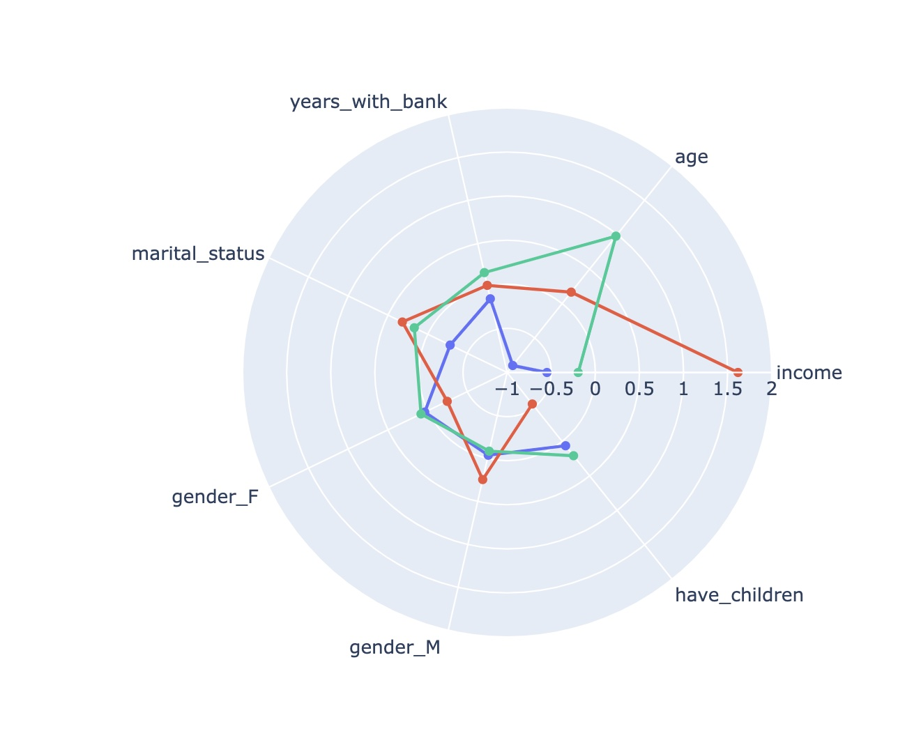
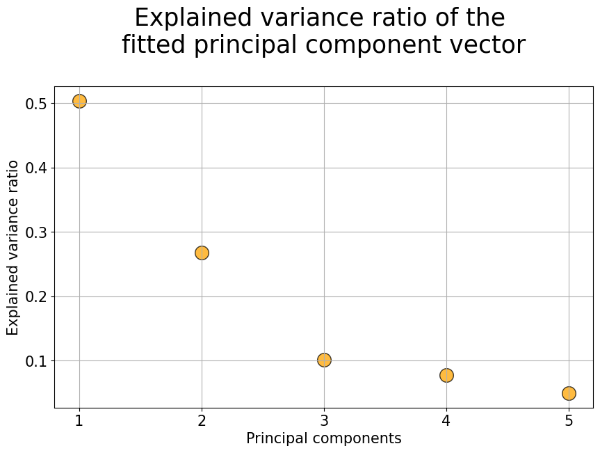
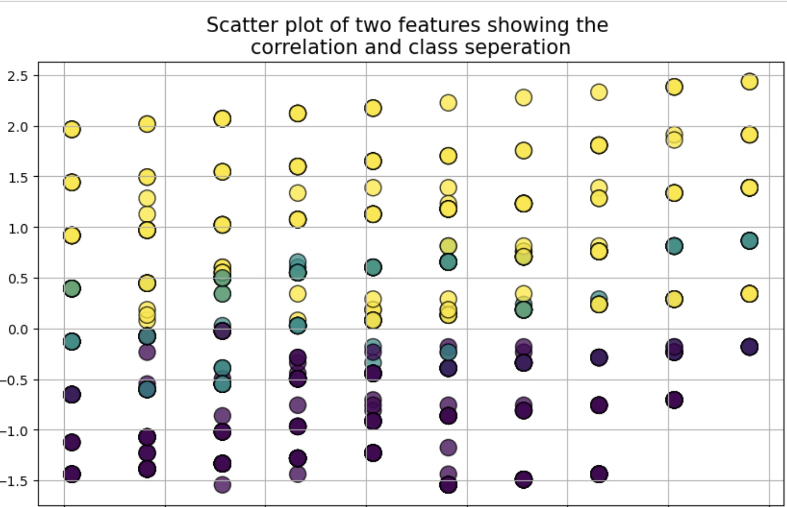
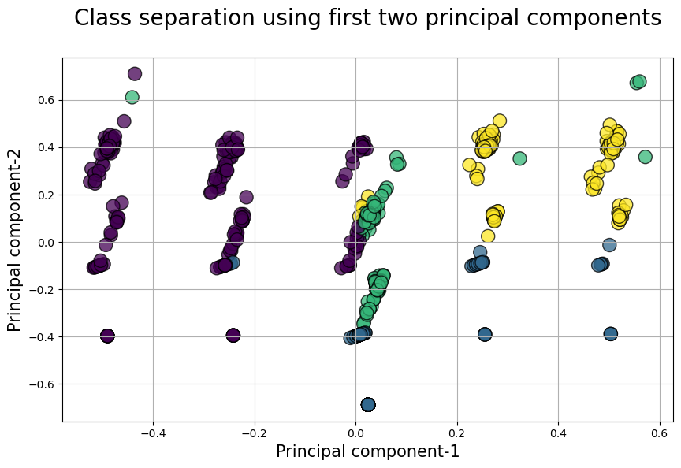

# mini-project-III

## Project Goals

The objective of this project was to analyze data about financial clients , and use this to generate clusters or groups of different clients, based on their personal data and their banking behaviour. 

Additionally, the project was to practise skills and gain experience with: 

- Collaboration 
- Data Wrangling
- Data Visualization
- Data Preparation and Feature Engineering
- Dimensionality Reduction
- Unsupervised Learning

## Process
# Data Inspection:

Before the spreadsheets were imported into Pandas DataFrames, they were viewed on Excel, and we inspect details like missing information, duplication, etc. They were then imported into Pandas DataFrames. We used visualization techniques like histograms, boxplots, and correlation matrices to check the distribution of data and observe outliers, etc.

# Feature Selection:
Based on our inspection, we decided that some columns were unnecessary (eg personal names, unique customer numbers, zip codes and cities) and discarded them. We then selected what we felt were the relevant features for each segmentation. Our choices eventually came to the following:

**Customer Segmentation features**:
1. `income` - (numerical) The assumed montly income of each client.
2. `age` - (numerical) The age of each client 
3. `years_with_bank` - (numerical) The number of years with the bank.
4. `marital_status` - (categorical) These are 4 classes (which we assumed represented single, married, divorced or widowed).
5. `have_children` - (categorical) originally 'number_of_children', this was binarized into 0 or 1 i.e. having any children or not.
6. `state_code_XX` where XX represents each state code - (categorical) Using `pd.get_dummies()`, we split the original `State_Code` into 33 columns.

**Banking Behaviour Segmentation features**:
1. `creditSpendToLimitRatio` - (numerical) average credit transactions each month divided by the credit limit (assuming monthly credit limit)
2. `averageMontlySpending` - (numerical) average checking account transactions per month
3. `numTnxMonthlyAverage` - (numerical) average number of transactions each month
4. `incomeToSavingsRanking` - (categorical) 5 classes showing how much of each customer's incoming went into their savings accounts each month
5. `numAccounts` - number of accounts each customer owned

We applied Pandas aggregate functions to get features that were not directly available e.g. creditSpendingtoLimit ratio.

# Data Wrangling

We explored our features via visualizations, and further fine-tuned the features, using different strategies, including but not limited to:

**Binarization**: We binarized some numerical columns e.g. a column that represented number of children was binarized to just having children - No for 0 children and Yes for anything else.

**Handling Outliers**: We removed some outliers by clipping, or converted numerical columns into cateogrical columns using bins or pd.qcut

Scaling: We applied sklearn scalar functions to the model dataset like `MinMaxScalar` and `StandardScalar` before we applied the Clustering functions.

# Clustering

We applied KMeans, DBSCAN and Hierarchcal Clustering functions to the different datasets.

## Results
### Clustering Outcomes

**Customer dataset**
| Type of Clustering    | n_clusters |
| --------------------- | ------- |
| KMeans                | 3       |
| DBSCAN                | 2       |
| Aggloremative         | 2       |

**Banking Behavior**

| Type of Clustering    | n_clusters |
| --------------------- | ------- |
| KMeans                | 4       |
| DBSCAN                | 5       |
| Aggloremative         | 6       |

### Radar Charts

1. Customers:

**Observations**: It seems that the `income`, `haschildren` and `age` the dominant criteria for clustering these datapoints. 

- Cluster 1 are high-income-earners, no children and middle-aged. 
- Cluster 2 are medium-income-earners, with children and aged older. 
- Cluster 3 are lesser-income-earners, maybe with children, and are the youngest aged. 

2. Banking Behaviour:

Below are the radar charts showing clusters of Banking Behavior, using the Agglomerative function. Please see the notebooks for the other outcomes. 

**Observations**: It seems that the `numAccounts` and `numTnxMonthlyAverage` are the dominant criteria for clustering these datapoints. It makes sense because the greater the number of accounts a customer has, the more likely they are to make more frequent transactions on any of those accounts. 

### Dimensionality Reduction with PCA

Plot of the expanded variance ratio for the customer features:

Note how the first 2 components contribute towards more than 50% of the total.

(See the notebook for the variance ratio of the customers). 

**Visualization with PCA for the Customers model**

**Observation**: 2 clusters are clearly separated with a third spread thinly through the boundary of the other 2. It is possible that visualizing with 2 other components will feature that one more prominently. 

**Visualization with PCA for the Banking Behaviour model**

**Observation**: There appear to be 5 clear groupings (probably based on the 5-class categorical `incomeToSavingsRanking` feature) but the clustering algorithms did not sort according to these groups, showing that this categorical feature did not dominate the other features. 

## Challenges:
1. Feature selection: it was a challenge to decide what information was relevant. For example, we wanted to keep as much information from the addresses as possible, but soon realized that would not be practical.
2. Handling categories: We observed that categories tended to bias the clustering i.e. the clustering functions would just group the datapoints by the dominant features like gender. We had to fine tune scaling parameters to offset this tendency.
3. Working with assumptions. We noticed that some customers in the bank did not have any accounts, but we had to assume that their data was still valid i.e. they had other banking accounts and were still active clients. We also had to make assumptions about the meaning of some columns e.g. that income was *montly* income and not *yearly* income. 

## Future Goals

Most of goals would have been about **feature engineering**. Given more time, we would have liked to combine the features from the customers-model and the banking-behavior-models to see what cluster results would have looked like. We would have also liked to correlate between age, income and marital status to better understand what the marital status classes meant. 

We would have also liked to done more **PCA** analysis, creating models from 2-3 dominant components and visualizing their output.

