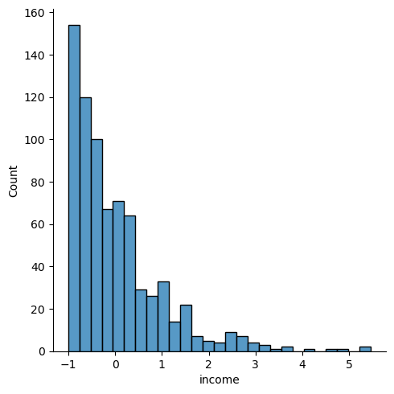

# mini-project-III

## Project Goals

The objective of this project was to analyze data about financial clients , and use this to generate clusters or groups of different clients, based on their personal data and their banking behaviour. 

Additionally, the project was to practise skills and gain experience with: 

- Collaboration 
- Data Wrangling
- Data Visualization
- Data Preparation and Feature Engineering
- Dimensionality Reduction
- Unsupervised Learning

## Process
# Data Inspection:

Before the spreadsheets were imported into Pandas DataFrames, they were viewed on Excel, and we inspect details like missing information, duplication, etc. They were then imported into Pandas DataFrames. We used visualization techniques like histograms, boxplots, and correlation matrices to check the distribution of data and observe outliers, etc.

# Feature Selection:
Based on our inspection, we decided that some columns were unnecessary (eg personal names, unique customer numbers, zip codes and cities) and discarded them. We then selected what we felt were the relevant features for each segmentation. Our choices eventually came to the following:

**Customer Segmentation features**:
1. `income` - (numerical) The assumed montly income of each client.
2. `age` - (numerical) The age of each client 
3. `years_with_bank` - (numerical) The number of years with the bank.
4. `marital_status` - (categorical) These are 4 classes (which we assumed represented single, married, divorced or widowed).
5. `have_children` - (categorical) originally 'number_of_children', this was binarized into 0 or 1 i.e. having any children or not.
6. `state_code_XX` where XX represents each state code - (categorical) Using `pd.get_dummies()`, we split the original `State_Code` into 33 columns.

**Banking Behaviour Segmentation features**:
1. `creditSpendToLimitRatio` - (numerical) average credit transactions each month divided by the credit limit (assuming monthly credit limit)
2. `averageMontlySpending` - (numerical) average checking account transactions per month
3. `numTnxMonthlyAverage` - (numerical) average number of transactions each month
4. `incomeToSavingsRanking` - (categorical) 5 classes showing how much of each customer's incoming went into their savings accounts each month
5. `numAccounts` - number of accounts each customer owned

We applied Pandas aggregate functions to get features that were not directly available e.g. creditSpendingtoLimit ratio.

# Data Wrangling

We explored our features via visualizations, and further fine-tuned the features, using different strategies, including but not limited to:

**Binarization**: We binarized some numerical columns e.g. a column that represented number of children was binarized to just having children - No for 0 children and Yes for anything else.

**Handling Outliers**: We removed some outliers by clipping, or converted numerical columns into cateogrical columns using bins or pd.qcut

Scaling: We applied sklearn scalar functions to the model dataset like `MinMaxScalar` and `StandardScalar` before we applied the Clustering functions.

# Clustering

We applied KMeans, DBSCAN and Hierarchcal Clustering functions to the different datasets.

## Results

**Customer dataset**

**Banking Behavior**

| Type of Clustering    | n_clusters |
| --------------------- | ------- |
| KMeans                | 4       |
| DBSCAN                | 5       |
| Aggloremative         | 6       |

# Stretch: Visualizing KMeans Clustering

